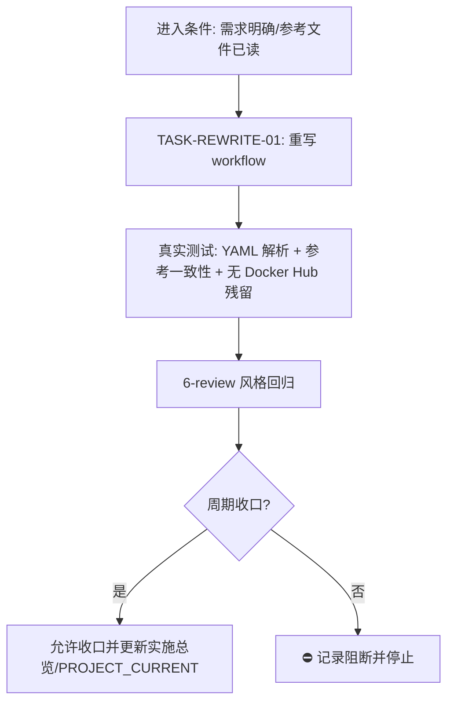

# 实施周期 02：docker-deploy 改为镜像直传部署

结论：把 `.github/workflows/docker-deploy.yml` 从"构建推送 Docker Hub + 服务器 pull"改为参考 `docker-image.yml` 的"构建 tar → scp 上传 → docker load → docker run"直传部署；影响：仅 GitHub Actions 流水线与远程服务器部署方式，不改应用代码与 Dockerfile；范围：只重写 `docker-deploy.yml` 一个 workflow 文件；非范围：不改 Dockerfile、不改应用代码、不动其它 workflow、不改远程服务器数据与持久化目录；变化：部署不再依赖 Docker Hub 与 `REGISTRY_PASSWORD`，镜像以 tar 直传服务器加载；完成标准：workflow 内容与参考模式一致、本地 YAML 校验通过、无 Docker Hub 登录/推送/拉取残留；术语说明：直传部署 = 在 CI 内 buildx 导出镜像 tar，scp 上传后在服务器 `docker load` 并 `docker run`；验证状态：本地 YAML 解析校验通过，真实部署需用户推送 main 或手动触发。

## 文档信息

```yaml
schema_version: 1
doc_id: "IMP-CYCLE-20260815-02"
doc_type: implementation_cycle
source_ids: ["SRC-USER-DIRECT-IMAGE-DEPLOY", "AC-01", "CYCLE-DOCKER-DEPLOY-02"]
status: draft
version: v1.0
current_slice: "SLICE-DOCKER-DEPLOY-02"
updated_at: "2026-08-15 14:00:09"
reader_level: business_general
writing_style: plain_chinese
appendix_policy: preserve_existing_or_one_terminal_appendix
style_regression: required_after_tests
```

## 当前周期目标

- 周期 ID / 期次定位：`CYCLE-DOCKER-DEPLOY-02` / 第二期（在既有 docker-deploy 实施总览下新增的改造周期）
- 只做这一件事：把 `docker-deploy.yml` 重写为"镜像直传服务器部署"模式
- 对应需求、验收和实施总览：来源为用户当前消息 + 参考文件 `C:\Users\luode\Desktop\docker-image.yml`；实施总览 `doc/3-实施/2026-08-15_173000_docker-deploy-workflow_实施总览.md`
- 本周期不做：不改 Dockerfile、应用代码、其它 workflow；不删除 `REGISTRY_PASSWORD` secret（保留但不再使用）；不真实验证远程服务器部署

## 周期图片资产决策与边界

- 图片资产决策：`N/A + 原因 + 证据`：纯 CI workflow 文件改造，无 UI/原型/截图/视觉对比/真实产物/空间布局/外观基线场景，无图片需求。
- Mermaid 边界：本周期为单文件简单改造，任务依赖与周期门禁用 Mermaid 表达，图片不参与。
- 生成与引用：不生成图片。
- 格式校验：N/A。

## 周期图片资产清单

| 图片 ID | 用途 / 生成输入 | 来源 | 相对路径 | 版本 | 关联 REQ/RULE / AC / CYCLE / TASK | 引用章节 | 敏感状态 | 版权状态 |
| --- | --- | --- | --- | --- | --- | --- | --- | --- |
| N/A + 原因 + 证据：无图片资产 | N/A | N/A | N/A | N/A | N/A | N/A | N/A | N/A |

## 进入条件与收口条件

| 类型 | 条件 | 证据/命令 | 状态 |
| --- | --- | --- | --- |
| 进入 | 用户已明确目标（直传镜像部署）、参考文件已读、实施总览已存在 | 本周期文档 + 参考文件已读入 | 满足 |
| 收口 | workflow 落盘、YAML 校验通过、6-review 完成 | 见"真实测试与断言" | 未开始 |



图形目的：说明周期内单任务闭环和收口门禁。关联 ID：`CYCLE-DOCKER-DEPLOY-02`、`TASK-REWRITE-01`。

## 当前代码基线

- 分支 / 提交：`main` 分支，git 工作树干净（会话起始快照），HEAD `ebc0def8`。
- 已核实文件和符号：
  - `.github/workflows/docker-deploy.yml`（当前：Docker Hub 登录推送 + SSH pull 部署，完整内容已读入）。
  - 参考文件 `C:\Users\luode\Desktop\docker-image.yml`（直传部署模板，完整内容已读入）。
  - `Dockerfile`（多阶段构建，ENTRYPOINT `/new-api`，完整内容已读入）。
  - `.dockerignore`（存在，忽略 `.github` 等，不影响 workflow）。
- 依赖版本与 local 配置：Git Bash on Windows；校验用 Python（`python -c "import yaml..."`）与 grep 字符串断言；无额外安装。
- 与计划不一致时的停止规则：若 `docker-deploy.yml` 内容与本次计划基线不一致（例如已被其它改动覆盖），立即停止并回写 `GAP-*`，不猜测落点。

## 跨会话执行入口与外部项目代码引用

- 新会话接手第一步：读取本周期文档、`doc/3-实施/2026-08-15_173000_docker-deploy-workflow_实施总览.md`、`.github/workflows/docker-deploy.yml` 与参考文件，核对基线后执行 TASK-REWRITE-01。
- 主项目名称与项目根（本机绝对路径或仓库 URL）：`F:\new-api`（Git 仓库，`main` 分支）。
- 主项目仓库类型与代码基线：Git，当前工作树 HEAD `ebc0def8`。
- 当前周期 / 任务标识与中断点核验顺序：`CYCLE-DOCKER-DEPLOY-02` / `TASK-REWRITE-01`；核验顺序 = `git status` → 读 workflow → 读参考文件 → 执行改写 → 校验。
- local 环境与依赖入口：Git Bash on Windows；Python YAML 解析；无服务器/无 GitHub Actions 本地执行。
- 外部项目代码引用：`N/A + 原因 + 证据`：无外部项目代码复制；只使用 GitHub Actions 官方/第三方托管 action（actions/checkout、docker/setup-qemu-action、appleboy/scp-action、appleboy/ssh-action），均按名称引用，不复制其代码。

| 引用 ID | 外部项目名称 | 外部项目地址 | 版本 / 提交 | 项目根相对路径 | 文件 / 符号 | 引用用途 | 许可证 / 复制边界 | 可达性检查与失败停止条件 | 使用 TASK / TEST / EVIDENCE 回指 |
| --- | --- | --- | --- | --- | --- | --- | --- | --- | --- |
| N/A | N/A | N/A | N/A | N/A | N/A | N/A | N/A | N/A | N/A |

## 周期内最小任务执行顺序

| 顺序 | 任务 ID | 唯一目标 | 前置依赖 | 允许文件 | 禁止触碰区 | 状态 |
| ---: | --- | --- | --- | --- | --- | --- |
| 1 | `TASK-REWRITE-01` | 把 `docker-deploy.yml` 重写为镜像直传服务器部署 | 无 | `.github/workflows/docker-deploy.yml` | Dockerfile、web/、relaykit/、其它 workflow、`doc/` 下既有文档、参考文件本身 | planned |

## 文件与符号操作契约

| 任务 | 文件路径 | 符号/区段 | 操作 | 修改前职责 | 修改后职责 | 调用方影响 | 兼容要求 |
| --- | --- | --- | --- | --- | --- | --- | --- |
| `TASK-REWRITE-01` | `.github/workflows/docker-deploy.yml` | 整个文件（on/jobs/env/steps 区块） | 修改（整体重写） | 构建推送 Docker Hub + SSH pull 部署 | buildx 导出 tar + scp 上传 + docker load/run 直传部署 | GitHub Actions 每次 main push / 手动触发行为变化；远程服务器不再 pull Docker Hub | 保持 main + workflow_dispatch 触发、concurrency、只读权限；保留真实部署参数（host 网络、5566、SQL_DSN、data/logs 卷、--log-dir） |

## 任务图片资产执行契约

| 任务 | 图片决策 | 生成输入与 imagegen 命令 | 目标资产路径 | Markdown 相对引用 | `IMG-*` / 版本 | 资产清单与引用章节 | Mermaid 不替代说明 |
| --- | --- | --- | --- | --- | --- | --- | --- |
| `TASK-REWRITE-01` | `N/A + 原因 + 证据`：纯 workflow 文本改造，无视觉资产场景 | N/A | N/A | N/A | N/A | N/A | N/A |

## 真实测试与断言

| 测试 ID | 对应任务 | 精确命令 | local 依赖 | fixture/数据 | 断言 | 失败预期 | 清理 |
| --- | --- | --- | --- | --- | --- | --- | --- |
| `TEST-YAML-01` | `TASK-REWRITE-01` | `python -c "import yaml,sys; yaml.safe_load(open(r'.github/workflows/docker-deploy.yml',encoding='utf-8')); print('YAML_OK')"` | Python3 + PyYAML | 改写后的 workflow 文件 | 输出 `YAML_OK`，无解析异常 | PyYAML 抛错或输出非 `YAML_OK` → 停止并修正缩进/语法 | 无（只读校验） |
| `TEST-CONSIST-01` | `TASK-REWRITE-01` | Python 脚本比对关键结构（含 `docker/buildx`、`setup-qemu-action`、`scp-action`、`ssh-action`、`type=docker,dest=`、`docker load`、`docker run`） | Python3 | 改写后 workflow 文件 | 关键结构断言全部通过 | 任一断言失败 → 停止并对照参考文件修正 | 无（只读校验） |
| `TEST-NOREG-01` | `TASK-REWRITE-01` | `grep -nE "docker (login|push|pull)|REGISTRY_PASSWORD" .github/workflows/docker-deploy.yml` | Git Bash grep | 改写后 workflow 文件 | grep 无匹配（退出码 1） | grep 命中 → 有残留，停止并清除 Docker Hub 相关行 | 无（只读校验） |

## 回滚与停止条件

- `ROLLBACK-01`：`git checkout -- .github/workflows/docker-deploy.yml`（当前工作树改动，未提交；如需回滚即丢弃工作树改动）。若已提交，则 `git revert <commit>`。
- 停止条件：YAML 解析失败、一致性断言失败、发现 Docker Hub 残留、参考文件缺失/不可读、基线不一致（workflow 已被其它改动覆盖）。
- 恢复路径：回到 `TASK-REWRITE-01` 起点，修正 workflow 后重跑 `TEST-YAML-01`/`TEST-CONSIST-01`/`TEST-NOREG-01`。
- 当前 agent 最大推进边界：只重写 workflow 文件 + 本地只读校验 + 6-review 记录；不提交、不推送、不触发 GitHub Actions、不连接远程服务器、不改 Dockerfile/应用代码。

## 周期追踪矩阵

| `REQ-*` / `RULE-*` | `AC-*` | `TASK-*` | 文件/符号 | `TEST-*` | `STYLE-*` | `EVIDENCE-*` | 闭环状态 |
| --- | --- | --- | --- | --- | --- | --- | --- |
| SRC-USER-DIRECT-IMAGE-DEPLOY（用户当前消息） | AC-01 | `TASK-REWRITE-01` | `.github/workflows/docker-deploy.yml` 全文件 | `TEST-YAML-01` | `STYLE-01` | 本周期文档 + 6-review 文档 | planned |
| SRC-REF-DOCKER-IMAGE（桌面参考文件） | AC-01 | `TASK-REWRITE-01` | 参考 `docker-image.yml` 直传结构 | `TEST-CONSIST-01` | `STYLE-01` | 本周期文档 + 6-review 文档 | planned |
| AGENTS.md 项目保护规则 | N/A | `TASK-REWRITE-01` | 全仓库（禁止触碰区） | N/A | `STYLE-01` | 不改项目标识 | planned |
| AGENTS.md relaykit 独立构建 | N/A | N/A（不改 Go/relaykit） | 不触碰 | N/A | N/A | 不涉及 | N/A |

## 周期自审

- 每个任务是否只承载一个目标：是，`TASK-REWRITE-01` 唯一目标是重写 workflow。
- 是否按实现 -> 真实测试 -> 6-review 风格回归逐个闭环：是，唯一任务按此顺序闭环。
- 是否存在未决决策或模糊落点：无未决决策（用户已明确"改成本直传上传镜像"）；落点为单一文件，明确。
- 图形、表格和正文是否一致：是，Mermaid 中任务/门禁与正文 `TASK-REWRITE-01`、`TEST-*`、`STYLE-*` 一致。

## 执行附录

- local 环境：Git Bash on Windows（win32 10.0.19045）。
- 任务步骤与精确命令：
  1. 用 Write 重写 `.github/workflows/docker-deploy.yml`（内容见实施总览更新后的"周期 2 计划"与下方脚本快照）。
  2. 运行 `TEST-YAML-01`：`python -c "import yaml,sys; yaml.safe_load(open(r'.github/workflows/docker-deploy.yml',encoding='utf-8')); print('YAML_OK')"`，期望输出 `YAML_OK`。
  3. 运行 `TEST-CONSIST-01`：断言文件包含 `docker/setup-qemu-action@v3`、`docker/buildx`、`type=docker,dest=`、`appleboy/scp-action`、`docker load -i`、`docker run`、`appleboy/ssh-action` 与既有 `SQL_DSN`/`5566`/`--log-dir`。
  4. 运行 `TEST-NOREG-01`：`grep -nE "docker (login|push|pull)|REGISTRY_PASSWORD" .github/workflows/docker-deploy.yml` 必须无匹配。
  5. 生成 `doc/6-review/` 风格回归记录。
- 预期失败：PyYAML 未安装时报 `ModuleNotFoundError` → 改用手动缩进核对或 `python -c "import yaml"` 失败时输出说明；YAML 语法错误时抛 `yaml.YAMLError` → 修正后重跑。
- 清理和回滚：未提交；`git checkout -- .github/workflows/docker-deploy.yml` 可回滚；不删除既有 `doc/` 文档。
- 改写后 workflow 脚本快照（供执行时直接落盘，含最终部署参数）：
```yaml
# 此文件相当简单
# 1. 检测到 main 分支有提交触发 jobs 任务，也支持手动触发
# 2. 指定一个 GitHub 服务器的环境 ubuntu-latest
# 3. 拉取当前代码到 GitHub 服务器
# 4. 读取 jobs.docker.env 中的动态配置，在 GitHub 服务器制作镜像并保存为 tar 包
# 5. 上传镜像 tar 包到远程服务器，停止旧容器、删除旧镜像、加载新镜像并启动新容器

name: Build and Deploy new-api

on:
  push:
    branches:
      - main
  workflow_dispatch:

concurrency:
  group: docker-deploy-new-api
  cancel-in-progress: true

permissions:
  contents: read

jobs:
  docker:
    runs-on: ubuntu-latest
    env:
      PROJECT_SLUG: new-api
      IMAGE_NAMESPACE: luode0320
      REMOTE_BASE_DIR: /usr/local/src
      TARGET_OS: linux
      TARGET_ARCH: amd64
      REMOTE_USER: root
      REMOTE_PORT: 22
      # 这里保留原始 docker run 参数写法，后续项目直接改这一段即可。
      DOCKER_RUN_ARGS: |
        -d \
        --network host \
        --restart=always \
        --name ${PROJECT_SLUG} \
        -e APP_ENV=prod \
        -e TZ=Asia/Shanghai \
        -e PORT=5566 \
        -e 'SQL_DSN=root:Ld588588@tcp(127.0.0.1:33060)/oneapi?charset=utf8mb4&parseTime=True&loc=Local' \
        -v /etc/hosts:/etc/hosts:ro \
        -v ${REMOTE_BASE_DIR}/${PROJECT_SLUG}/data:/data \
        -v ${REMOTE_BASE_DIR}/${PROJECT_SLUG}/logs:/app/logs
      # 镜像名之后追加的容器命令（Dockerfile ENTRYPOINT /new-api 的参数）
      DOCKER_RUN_CMD: --log-dir /app/logs

    steps:
      - uses: actions/checkout@v5

      - uses: docker/setup-qemu-action@v3

      - name: 打包镜像归档
        shell: bash
        run: |
          set -euo pipefail

          # 1. 以项目名为基准派生镜像名、tar 包名、builder 名和远程目录，减少重复前缀配置。
          IMAGE="${IMAGE_NAMESPACE}/${PROJECT_SLUG}:latest"
          IMAGE_TAR="${PROJECT_SLUG}.tar"
          BUILDER_NAME="${PROJECT_SLUG}-builder"
          APP_DIR="${REMOTE_BASE_DIR}/${PROJECT_SLUG}"

          {
            echo "IMAGE=${IMAGE}"
            echo "IMAGE_TAR=${IMAGE_TAR}"
            echo "BUILDER_NAME=${BUILDER_NAME}"
            echo "APP_DIR=${APP_DIR}"
          } >> "${GITHUB_ENV}"

          # 2. buildx builder 名称由项目名派生，避免跨项目复用时残留固定命名。
          docker buildx create --use --name "${BUILDER_NAME}"
          docker buildx inspect --bootstrap
          # 3. 镜像平台、镜像名和 tar 名都从项目派生结果中读取，确保构建参数可复用。
          docker buildx build \
            --platform "${TARGET_OS}/${TARGET_ARCH}" \
            --output "type=docker,dest=${IMAGE_TAR}" \
            -t "${IMAGE}" \
            -f Dockerfile .

      - name: 上传镜像归档
        uses: appleboy/scp-action@master
        with:
          host: ${{ secrets.REMOTE_HOST }}
          username: ${{ env.REMOTE_USER }}
          password: ${{ secrets.REMOTE_PASSWORD }}
          port: ${{ env.REMOTE_PORT }}
          source: ${{ env.PROJECT_SLUG }}.tar
          target: ${{ env.REMOTE_BASE_DIR }}/${{ env.PROJECT_SLUG }}

      - name: 登录服务器并部署
        uses: appleboy/ssh-action@master
        with:
          host: ${{ secrets.REMOTE_HOST }}
          username: ${{ env.REMOTE_USER }}
          password: ${{ secrets.REMOTE_PASSWORD }}
          port: ${{ env.REMOTE_PORT }}
          script: |
            # 1. 先按项目名派生镜像、tar 包和远程目录，确保相似前缀只维护一份。
            set -euo pipefail
            PROJECT_SLUG="${{ env.PROJECT_SLUG }}"
            IMAGE_NAMESPACE="${{ env.IMAGE_NAMESPACE }}"
            REMOTE_BASE_DIR="${{ env.REMOTE_BASE_DIR }}"
            APP_DIR="${REMOTE_BASE_DIR}/${PROJECT_SLUG}"
            IMAGE="${IMAGE_NAMESPACE}/${PROJECT_SLUG}:latest"
            IMAGE_TAR="${PROJECT_SLUG}.tar"
            CONTAINER="${{ env.PROJECT_SLUG }}"
            if [ -z "${CONTAINER}" ]; then
              CONTAINER="${PROJECT_SLUG}"
            fi
            DOCKER_RUN_ARGS=$(cat <<'EOF'
            ${{ env.DOCKER_RUN_ARGS }}
            EOF
            )
            DOCKER_RUN_CMD="${{ env.DOCKER_RUN_CMD }}"

            TAR_PATH="${APP_DIR}/${IMAGE_TAR}"

            if [ ! -s "${TAR_PATH}" ]; then
              echo "image archive not found: ${TAR_PATH}"
              exit 1
            fi

            mkdir -p "${APP_DIR}/data" "${APP_DIR}/logs"

            # 2. 删除旧镜像前先打印当前镜像 hash，方便和后续加载后的镜像做对比。
            docker image inspect "${IMAGE}" --format 'before remove image id={{.Id}}' || true
            docker rm -f "${CONTAINER}" || true
            docker rmi "${IMAGE}" || true

            # 3. 加载新镜像后立即打印当前标签对应的镜像 hash，确认远端已切到新内容。
            docker load -i "${TAR_PATH}"
            docker image inspect "${IMAGE}" --format 'after load image id={{.Id}}'

            # 4. 这里允许在 env 中直接保留完整参数块写法，例如 -v/-e/--add-host/--entrypoint 等。
            eval "docker run ${DOCKER_RUN_ARGS} \"${IMAGE}\" ${DOCKER_RUN_CMD}"
            # 5. 立即校验容器状态，避免日志里只看到上传成功却没有发现新容器未对外提供服务。
            docker ps --filter "name=^/${CONTAINER}$"
            rm -f "${TAR_PATH}"
```

## 追踪附录

- 稳定 ID：`CYCLE-DOCKER-DEPLOY-02`、`TASK-REWRITE-01`、`TEST-YAML-01`、`TEST-CONSIST-01`、`TEST-NOREG-01`、`STYLE-01`、`AC-01`、`EVIDENCE-DEPLOY-02`。
- 需求来源 / 验收依据 / 证据：来源 = 用户消息 + 参考文件；AC = workflow 直传模式 + YAML 校验通过 + 无 Docker Hub 残留；证据 = 本周期文档 + `doc/6-review/2026-08-15_140009_docker-deploy-workflow_6-review.md`。
- 追踪矩阵：见"周期追踪矩阵"。
- 附录维护规则：执行附录与追踪附录连续位于文档末尾，后无业务正文。
