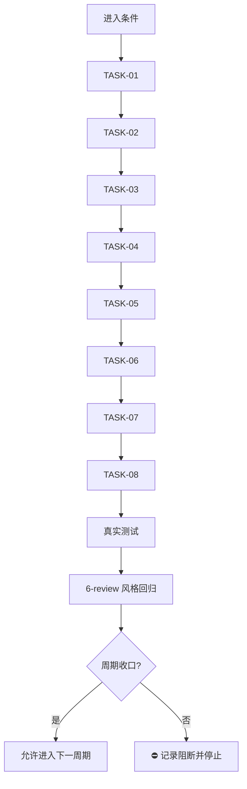

# 实施周期：链动小铺兑换码方案 — 档位与核销加固

结论：本周期把兑换码体系升级到可面向链动小铺方案使用；影响：管理员可按档位一键批量生成码、兑换核销写账单并被 int32 保护、兑换码独立于支付合规开关；范围：覆盖 TASK-01~TASK-08 的实现、真实测试、6-review 与周期收口；非范围：不触碰任何支付路由、不改造钱包页 UI、不改 Redemption 表 schema、不展开错误细分、不做一码多人兑；变化：管理员创建兑换码不再要求先确认支付合规，兑换后充值历史可见；完成标准：所有任务满足实施计划完成条件、实现、真实测试、6-review 四项闭环；术语说明：档位=面额 tier，合规=支付合规条款；验证状态：执行前按本地真实结果确认。

## 文档信息

```yaml
schema_version: 1
doc_id: "IMP-CYCLE-20260816-01"
doc_type: implementation_cycle
source_ids: ["链动小铺兑换码方案", "CYCLE-01"]
status: completed
version: v1.0
current_slice: "SLICE-01"
updated_at: "2026-08-16 02:25:00"
reader_level: business_general
writing_style: plain_chinese
appendix_policy: preserve_existing_or_one_terminal_appendix
style_regression: required_after_tests
```

## 当前周期目标

- 周期 ID / 期次定位：`CYCLE-01` / 第一期
- 只做这一件事：让兑换码体系可面向链动小铺方案使用（档位、独立开关、账单、饱和保护）
- 对应需求、验收和实施总览：`doc/3-实施/2026-08-16_链动小铺兑换码方案_实施总览.md`
- 本周期不做：钱包页 UI、支付路由、表 schema、错误细分、一码多人兑、档位→独立商品页链接映射

## 周期图片资产决策与边界

- 图片资产决策：`N/A` + 原因（纯代码/配置改造，无视觉资产需求）+ 证据（改动落在现有 React 组件与 Go 文件）。
- Mermaid 边界：任务依赖与收口门禁由下方 Mermaid 表达。
- 生成与引用：N/A。

## 周期图片资产清单

| 图片 ID | 用途 / 生成输入 | 来源 | 相对路径 | 版本 | 关联 REQ/RULE / AC / CYCLE / TASK | 引用章节 | 敏感状态 | 版权状态 |
| --- | --- | --- | --- | --- | --- | --- | --- | --- |
| `IMG-*` | 无 | N/A | N/A | N/A | N/A | N/A | N/A | N/A |

## 进入条件与收口条件

| 类型 | 条件 | 证据/命令 | 状态 |
| --- | --- | --- | --- |
| 进入 | 需求、边界、实施总览 `AC-*` 已确认 | 总览已落盘 | 满足 |
| 收口 | 所有任务实现、真实测试、6-review 三项闭环通过 | `go build ./... && go test ./...`、6-review 记录 | 待完成 |



图形目的：说明周期内单任务闭环与收口门禁。关联 ID：`CYCLE-01`、`TASK-01~08`。

## 当前代码基线

- 分支 / 提交：`main` 分支当前 HEAD（实施时以 `git rev-parse HEAD` 为准）。
- 已核实文件和符号：`model/redemption.go`（`Redeem`）、`model/topup.go`（`creditTopUpQuota`、`TopUp`）、`controller/redemption.go`（`AddRedemption`）、`controller/topup.go`（`GetTopUpInfo`）、`controller/user.go`（`TopUp`）、`setting/operation_setting/payment_setting.go`（模式参考）、`web/src/features/redemption-codes/components/redemptions-mutate-drawer.tsx`、`web/src/features/redemption-codes/lib/redemption-form.ts`、`web/src/features/wallet/hooks/use-topup-info.ts`、`web/src/features/system-settings/general/quota-settings-section.tsx`。
- 依赖版本与 local 配置：Go 1.22+，bun，SQLite。
- 与计划不一致时的停止规则：发现符号不存在、接口已变化或基线不一致，立即停止并回写 `GAP-*`，不得猜测替代落点。

## 跨会话执行入口与外部项目代码引用

- 新会话接手第一步：`cd /f/new-api && git rev-parse HEAD`，核验 §当前代码基线 符号，从第一个未完成 `TASK-*` 进入。
- 主项目名称与项目根：`new-api`，`F:\new-api`。
- 主项目仓库类型与代码基线：Git，`main`。
- 当前周期 / 任务标识与中断点核验顺序：`CYCLE-01`、`TASK-01`~`TASK-08`；核验 §文件与符号操作契约 所列落点。
- local 环境与依赖入口：Go `go build ./...`；前端 `cd web && bun install && bun run dev`。
- 外部项目代码引用：N/A + 原因（只读取当前项目）+ 证据（已检索 `F:\new-api` 根目录）。

## 周期内最小任务执行顺序

| 顺序 | 任务 ID | 唯一目标 | 前置依赖 | 允许文件 | 禁止触碰区 | 状态 |
| ---: | --- | --- | --- | --- | --- | --- |
| 1 | `TASK-01` | 档位+开关配置 | 无 | `setting/operation_setting/` | 支付路由、钱包页 | completed |
| 2 | `TASK-02` | 配置落库 | TASK-01 | `model/option.go` | 同上 | completed |
| 3 | `TASK-03` | 枚举 | 无 | `model/topup.go` | 同上 | completed |
| 4 | `TASK-04` | 核销加固 | TASK-03 | `model/redemption.go` | 同上 | completed |
| 5 | `TASK-05` | 解耦+下发 | TASK-01,04 | `controller/redemption.go`、`controller/user.go`、`controller/topup.go` | 同上 | completed |
| 6 | `TASK-06` | 前端档位按钮 | TASK-05 | `redemptions-mutate-drawer.tsx`、`redemption-form.ts` | 钱包页 | completed |
| 7 | `TASK-07` | 后台配置 UI | TASK-05 | `quota-settings-section.tsx`（或新文件） | 钱包页 | completed |
| 8 | `TASK-08` | 测试收口 | TASK-01~07 | 测试文件 | 同上 | completed |

## 文件与符号操作契约

| 任务 | 文件路径 | 符号/区段 | 操作 | 修改前职责 | 修改后职责 | 调用方影响 | 兼容要求 |
| --- | --- | --- | --- | --- | --- | --- | --- |
| `TASK-01` | `setting/operation_setting/redemption_setting.go` | `RedemptionSetting` / `GetRedemptionTiers` / `IsRedemptionEnabled` | 新增 | 无 | 提供档位与独立开关 | `controller`、`model/option.go` | 默认值可 JSON 回写 |
| `TASK-02` | `model/option.go` | `InitOptionMap` / `UpdateOption` switch | 修改 | 管理全局 options 默认值与回写 | 增加 `redemption_setting.*` | 无 | 首次启动落默认 |
| `TASK-03` | `model/topup.go` | `PaymentMethodRedemption` / `PaymentProviderRedemption` | 修改 | 现有枚举 | 新增兑换码枚举 | `model/redemption.go` | 字符串常量 |
| `TASK-04` | `model/redemption.go` | `Redeem` | 修改 | 裸 `quota+?` + 无 TopUp | 复用 `creditTopUpQuota` + 写 TopUp | 用户兑换路径 | 保持幂等 |
| `TASK-05` | `controller/redemption.go` | `AddRedemption` | 修改 | 合规门检 + 固定 Quota | `IsRedemptionEnabled` + `tier_money` | 管理员建码 | 兼容 Quota 直传 |
| `TASK-05` | `controller/user.go` | `TopUp` | 修改 | 合规门检 | `IsRedemptionEnabled` | 用户兑换 | 行为等价 |
| `TASK-05` | `controller/topup.go` | `GetTopUpInfo` | 修改 | 下发 `enable_redemption`=合规 | 改用独立开关 + 下发 `redemption_tiers` | 前端钱包 | 新增字段向前兼容 |
| `TASK-06` | `web/.../redemptions-mutate-drawer.tsx` | `quota_dollars` 字段区块 | 修改 | 自由输入 | 增加档位快选按钮 | 管理员建码 | i18n key |
| `TASK-06` | `web/.../redemption-form.ts` | schema | 修改 | 仅 quota_dollars | 支持 `tier_money` | 表单 | 兼容 |
| `TASK-07` | `web/.../quota-settings-section.tsx`（或新文件） | 配置表单 | 修改 | 现有 TopUpLink | 增加档位+开关配置 | 管理员设置 | i18n key |

## 任务图片资产执行契约

| 任务 | 图片决策 | 生成输入与 imagegen 命令 | 目标资产路径 | Markdown 相对引用 | `IMG-*` / 版本 | 资产清单与引用章节 | Mermaid 不替代说明 |
| --- | --- | --- | --- | --- | --- | --- | --- |
| `TASK-01`~`TASK-08` | `N/A + 原因（纯代码/配置改造）+ 证据` | N/A | N/A | N/A | N/A | N/A | 流程/依赖由 Mermaid 表达 |

## 真实测试与断言

| 测试 ID | 对应任务 | 精确命令 | local 依赖 | fixture/数据 | 断言 | 失败预期 | 清理 |
| --- | --- | --- | --- | --- | --- | --- | --- |
| `TEST-01` | `TASK-01` | `go test ./setting/operation_setting/...` | Go+SQLite | 默认值/JSON | 档位=默认、开关=true、回写生效 | 断言失败 | 无 |
| `TEST-02` | `TASK-02` | `go test ./model/...` | Go+SQLite | option 更新 | `IsRedemptionEnabled` 随更新变化 | 断言失败 | 无 |
| `TEST-04` | `TASK-04` | `go test ./model/...` | Go+SQLite | 用户+码 | 加额度、写 TopUp、重复兑换失败、饱和保护 | 断言失败 | 无 |
| `TEST-05` | `TASK-05` | `go test ./controller/...` | Go+SQLite+gin | 关闭合规、tier_money | 解耦可用、非法档位拒绝、下发字段 | 断言失败 | 无 |
| `TEST-08` | `TASK-08` | `go build ./... && go test ./...` | Go | 全量 | 全部通过 | 任一失败 | 无 |

## 回滚与停止条件

- `ROLLBACK-01`：恢复 `model/redemption.go`、`controller/*.go`、`setting/operation_setting/*.go`、`model/option.go`、前端文件的被改内容：`git checkout -- <文件>`。
- `ROLLBACK-02`：数据库配置项清空 `redemption_setting.*` 恢复默认。
- 停止条件：命令失败、断言失败、依赖不可用、数据不符合前置、计划落点不存在或发现安全/数据损坏风险。
- 恢复路径：回到对应 `TASK-*`，补证据后重启。
- 当前 agent 最大推进边界：完成 `CYCLE-01` 全部任务与收口；不自动进入任何后续周期或新需求。

## 周期追踪矩阵

| `REQ-*` / `RULE-*` | `AC-*` | `TASK-*` | 文件/符号 | `TEST-*` | `STYLE-*` | `EVIDENCE-*` | 闭环状态 |
| --- | --- | --- | --- | --- | --- | --- | --- |
| 链动小铺兑换码方案 | `AC-01` 档位可配 | `TASK-01/02/05` | `redemption_setting.go`、`option.go`、`topup.go` | `TEST-01/02/05` | `STYLE-01` | `EVIDENCE-01` | completed |
| 同上 | `AC-02` 核销写账单+饱和保护 | `TASK-03/04` | `topup.go`、`redemption.go` | `TEST-04` | `STYLE-02` | `EVIDENCE-02` | completed |
| 同上 | `AC-03` 兑换码独立于合规 | `TASK-05` | `controller/*.go` | `TEST-05` | `STYLE-03` | `EVIDENCE-03` | completed |
| 同上 | `AC-04` 前端档位按钮 | `TASK-06` | 抽屉组件 | `TEST-08` | `STYLE-04` | `EVIDENCE-04` | completed |
| 同上 | `AC-05` 后台配置 UI | `TASK-07` | 设置组件 | `TEST-08` | `STYLE-05` | `EVIDENCE-05` | completed |

## 周期自审

- 每个任务是否只承载一个目标：是。
- 是否按实现 -> 真实测试 -> 6-review 风格回归逐个闭环：是（任务卡已定义）。
- 是否存在未决决策或模糊落点：否。
- 图形、表格和正文是否一致：是。

## 执行附录

- local 环境：Windows，Go 1.22+，bun，SQLite。
- 任务步骤、精确命令、样本、SQL、接口报文：
  - `cd /f/new-api && go build ./...`、`go test ./...`。
  - 档位 JSON：`[5,10,20,50,100,500]`。
  - 兑换码 key：32 位 hex（`common.GetUUID`）。
  - 接口：`POST /api/redemption`（新增 `tier_money`）；`GET /api/user/topup/info`（新增 `redemption_tiers`）。
- 清理与回滚顺序：回指「回滚与停止条件」`ROLLBACK-01/02`。

## 追踪附录

- 稳定 ID：`链动小铺兑换码方案`、`CYCLE-01`、`TASK-01~08`、`TEST-01~08`、`STYLE-01~05`、`EVIDENCE-01~05`。
- 追踪矩阵：见「周期追踪矩阵」。
- 证据定位：实施后落 `doc/6-review/2026-08-16_链动小铺兑换码方案_6-review.md`。
