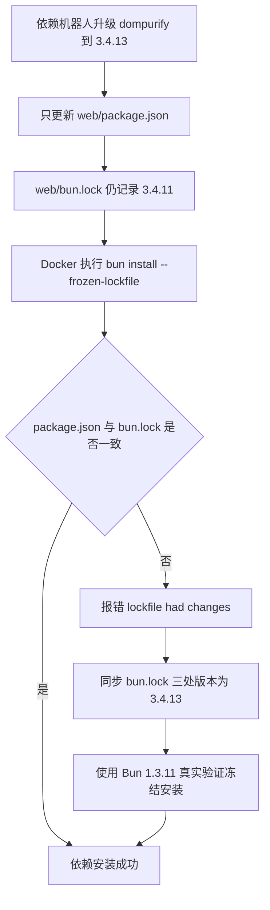
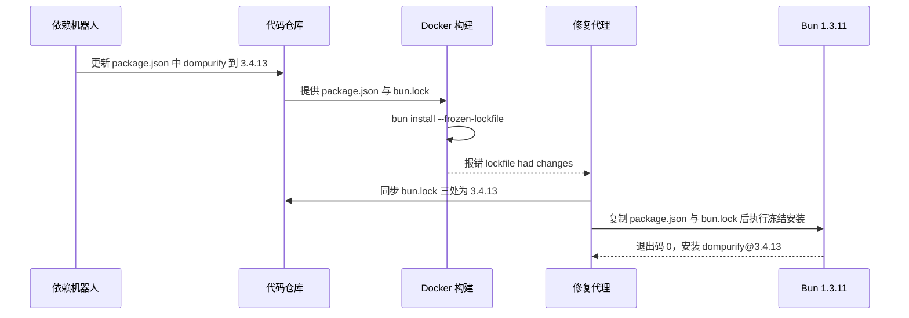

# Bug：Docker 构建失败，bun.lock 中 dompurify 版本不一致

结论：`web/package.json` 已由依赖机器人升级到 `dompurify@3.4.13`，但 `web/bun.lock` 仍记录 `3.4.11`，导致 Docker 构建阶段执行 `bun install --frozen-lockfile` 时提示锁文件已变化并失败；影响：所有通过 Dockerfile 构建镜像的开发者和 CI 流水线；范围：本次只修复 `web/bun.lock` 的 `dompurify` 版本同步，不改 workflow、Dockerfile 或应用代码；非范围：不处理其它依赖的锁文件漂移，不做前端功能改动；变化：修复后 Docker 构建阶段可以继续执行并安装 `dompurify@3.4.13`；完成标准：使用 Bun 1.3.11 对当前 `package.json` 与 `bun.lock` 执行 `bun install --frozen-lockfile` 成功，且安装结果为 `dompurify@3.4.13`；术语说明：无技术术语需要解释；验证状态：已用 Bun 1.3.11 完成真实验证，冻结安装退出码 0，并确认安装到 `dompurify@3.4.13`。

## 问题现象

- GitHub Actions Docker 构建在 `builder 4/7` 失败。
- 报错原文：`error: lockfile had changes, but lockfile is frozen`。
- 失败步骤是 `RUN bun install --frozen-lockfile`。

## 影响范围

- 使用 Dockerfile 构建 `web` 前端的镜像构建流程。
- 当前新增的 `.github/workflows/docker-deploy.yml` 也会因为同一前端构建步骤失败。

## 出现环境

- Docker 构建阶段使用 `oven/bun` 镜像。
- 报错日志显示 Bun 版本 `1.3.11`。
- 本地复现路径为 `web/package.json` 与 `web/bun.lock` 组合执行 `bun install --frozen-lockfile`。

## 触发条件

- `web/package.json` 声明 `dompurify: "3.4.13"`。
- `web/bun.lock` 的 workspace dependencies、overrides 和 packages 条目仍记录 `3.4.11`。
- Dockerfile 第 5 行执行 `RUN bun install --frozen-lockfile`。

## 期望结果

- `web/package.json` 与 `web/bun.lock` 的 `dompurify` 版本一致。
- `bun install --frozen-lockfile` 应成功完成，不报锁文件变化。

## 实际结果

- `web/bun.lock` 三处仍为 `3.4.11`，与 `package.json` 的 `3.4.13` 不一致。
- `bun install --frozen-lockfile` 返回退出码 1，构建中断。

## 当前证据

- 提交 `f250f3b5` 的 diff 只修改 `web/package.json`，未修改 `web/bun.lock`。
- `git diff -- web/bun.lock` 确认修复后仅 3 行变化，均与 `dompurify` 版本相关。
- 真实验证命令与输出记录在测试主文档。

## 当前缺失项

- 无。根因、修复方案和真实验证均已闭环。

## 图示产物（必填，直接写入本文档正文）

### 流程图

图形目的：展示从依赖版本漂移到 Docker 构建失败、再到 lockfile 同步和真实安装验证的完整流程。
关联 ID：`BUG-BUN-LOCKFIX-FLOW-001`

### 时序图

图形目的：展示依赖机器人提交、Docker 构建失败、本地同步 lockfile 与真实安装验证之间的调用顺序。
关联 ID：`BUG-BUN-LOCKFIX-SEQ-001`

## 文档信息

- 文档 ID：`BUG-BUN-LOCKFIX-001`。
- 来源对象：`SRC-BUN-LOCKFIX-001`。
- 修复任务：`TASK-BUN-LOCKFIX-03`。
- 验证证据：`TEST-BUN-LOCKFIX-001`。

## 完成标准

- `bun install --frozen-lockfile` 在 Bun 1.3.11 下退出码 0。
- `dompurify` 安装结果为 `3.4.13`。

## 图片资产决策

图片资产决策：N/A，原因：本轮不涉及截图、原型或视觉资产，证据：无 Markdown 图片引用。

## 执行附录

- local 环境：Windows PowerShell，Node `v24.17.0`，npm `11.13.0`，Python `3.14.6`。
- 根因证据：
  - `git show --stat f250f3b5` 显示仅 `web/package.json` 变更。
  - 原始构建日志显示 `bun install v1.3.11` 与 `error: lockfile had changes, but lockfile is frozen`。
- 修复步骤：
  - 将 `web/bun.lock` 的 workspace dependencies、overrides、packages 三处 `3.4.11` 同步为 `3.4.13`。
  - 将 packages 条目 integrity 替换为 npm 官方 `dompurify@3.4.13` 的 `sha512-2vmYIoqjze2d+kakP8S/nS5shfsl587kzwEjcGlTdiksUVgFHnFCsLYDVj/JNqJVOQZGSYBTmuycv0PodwmnMQ==`。
- 验证步骤：
  - 临时目录安装 `bun@1.3.11`。
  - 复制 `web/package.json` 与 `web/bun.lock` 到独立临时工作目录。
  - 执行 `bun install --frozen-lockfile`。
  - 观察输出包含 `dompurify@3.4.13` 且退出码为 0。
- 清理与回滚：
  - 若需回滚，将 `web/bun.lock` 恢复为 `3.4.11` 三处即可；但会重新触发本次构建失败。

## 追踪附录

- 来源：用户反馈 Docker 构建失败日志。
- Bug 稳定 ID：`BUG-BUN-LOCKFIX-001`。
- 根因结论：依赖机器人只更新 `package.json`，未同步 `bun.lock`，导致冻结锁文件校验失败。
- 修复方案：直接同步 lockfile 三处版本，并从源头消除 package 与 lockfile 漂移。
- 验证证据：`doc/5-tests/2026-08-15_120351_bun-lock-dompurify冻结安装验证.md`。
- 风格证据：`doc/6-review/2026-08-15_120351_bun-lockfix_6-review.md`。
- 变更记录：2026-08-15 录入并修复；2026-08-15 完成真实冻结安装验证。
