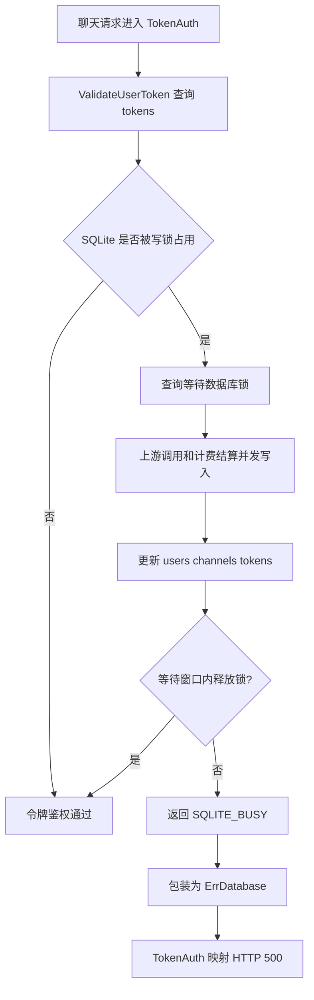
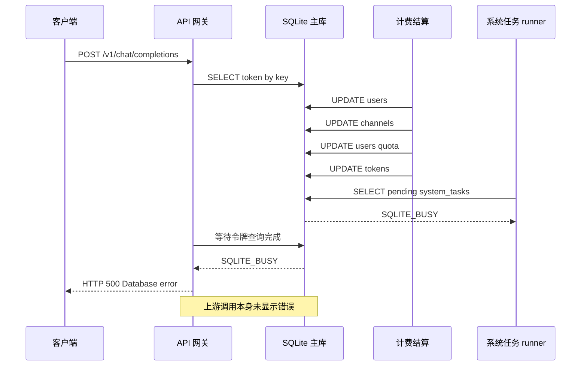

# Bug：SQLite 锁竞争导致聊天请求返回 500

结论：一次聊天请求在上游正常返回后，本地 SQLite 正在处理连续扣费写入，令牌鉴权查询等待约 5 秒后因数据库仍被锁定而失败，接口最终返回 500；影响：使用 SQLite 主库并发处理聊天请求的用户，以及依赖令牌鉴权的 `/v1/chat/completions` 请求；范围：本记录确认 2026-08-22 02:17 左右的扣费写入、令牌鉴权、系统任务查询和 500 返回链路；非范围：当前不判断上游模型、网络或计费金额计算是否错误；变化：上游没有报错，但客户端收到“数据库错误”并等待约 5 秒；完成标准：能稳定复现或通过并发测试证明写入期间鉴权查询不会因 SQLite 锁竞争返回 500，并确认扣费数据不丢失、不重复；术语说明：SQLite_BUSY 表示 SQLite 在等待其他连接释放数据库锁后仍未能完成当前操作；验证状态：已根据线上日志和当前代码完成静态根因定位，尚未执行线上运行时复现或修复后的回归测试。

## 问题现象

- `/v1/chat/completions` 请求在上游无错误的情况下返回 HTTP 500。
- 同一时间段出现多条 SQLite 慢写入：用户已用额度和请求次数、频道已用额度、用户额度、令牌额度连续更新。
- 随后的 `system_tasks` 查询和 `tokens` 令牌查询均出现 `sqlite error 5`，并在约 5 秒后报 `database is locked (5) (SQLITE_BUSY)`。
- 令牌鉴权将数据库错误转换为 500，而不是将其当作无效令牌返回 401。

## 影响范围

- 受影响接口：`POST /v1/chat/completions`，以及其他复用 `TokenAuth` 的接口。
- 受影响业务：令牌鉴权、聊天请求扣费、后台系统任务查询。
- 主要影响条件：主数据库使用 SQLite，且并发请求或后台任务同时产生较多写入。

## 出现环境

- 环境：线上运行环境，日志时间为 `2026-08-22 02:17:15` 至 `02:17:20`，时区按日志记录为 GMT+8。
- 数据库：SQLite 主库；当前代码默认使用 `one-api.db?_busy_timeout=30000`。
- 代码版本：当前工作区分支 `main`，HEAD 为 `0092ff6c fix: 部署`。
- 当前代码默认连接池：`SQL_MAX_IDLE_CONNS=100`，`SQL_MAX_OPEN_CONNS=1000`；未发现 SQLite 专用 WAL 或单写连接限制配置。

## 触发条件

1. 聊天请求完成上游调用并进入计费结算。
2. 结算链路连续更新 `users`、`channels`、`tokens` 表。
3. SQLite 的一个或多个连接持有写锁时，新的令牌鉴权请求执行 `SELECT`。
4. 查询在当前等待窗口内未能取得锁，驱动返回 `SQLITE_BUSY`。

## 期望结果

- 上游调用正常时，本地短暂的数据库写入竞争不应直接让新请求返回 500。
- SQLite 写入应在可控等待和合理连接并发下完成；鉴权查询应能正常读取。
- 如果数据库确实不可用，应有明确的可观测错误和可恢复策略，且不能让扣费状态出现半完成、重复或丢失。

## 实际结果

- `users` 的更新耗时 `1558.561ms`、`2329.551ms`。
- `channels` 的更新耗时 `495.250ms`。
- `tokens` 的更新耗时 `1105.706ms`。
- `system_tasks` 查询耗时 `5012.218ms` 后返回 `SQLITE_BUSY`。
- `tokens` 鉴权查询耗时 `5032.255ms` 后返回 `SQLITE_BUSY`。
- `middleware/auth.go` 将 `model.ErrDatabase` 映射为 HTTP 500，客户端看到数据库错误。

## 当前证据

### 静态根因定位

根因已收敛为：SQLite 主库的并发写入竞争使数据库锁长期未释放，令牌鉴权读取最终超时并返回 `SQLITE_BUSY`；连接池规模过大放大了同时竞争 SQLite 文件锁的连接数量。

证据链如下：

1. `model/user.go:1368`、`model/channel.go:881`、`model/user.go:1313`、`model/token.go:427` 都是同一请求计费阶段的数据库写入，日志显示这些写入连续处于数百毫秒到数秒的慢状态。
2. `model/main.go:167-168` 使用 `common.SQLitePath` 打开 SQLite；`common/database.go:44` 的默认 DSN 只有 `_busy_timeout=30000`，没有看到 WAL 配置。
3. `model/main.go:193-195` 默认将主库连接池设置为最多 1000 个连接。SQLite 文件级写锁不支持这样的写并发规模，连接池会让更多请求同时进入锁竞争。
4. `model/token.go:220-257` 的 `ValidateUserToken` 调用 `GetTokenByKey` 查询令牌；数据库错误会包装为 `ErrDatabase`。
5. `middleware/auth.go:409-424` 明确把 `ErrDatabase` 转换为 HTTP 500，因此鉴权查询失败直接造成接口失败。
6. `service/text_quota.go:447-452` 在记录消耗日志前后触发用户和频道用量更新；`service/quota.go:435-453` 与 `service/billing_session.go:243-264` 还会触发用户钱包和令牌额度更新，说明聊天请求的扣费路径确实包含多次写操作。
7. `service/system_task.go:231-234` 的系统任务 runner 在同一数据库上查询失败并记录告警，说明锁竞争并非只影响单个令牌查询。

当前可排除或暂不支持的判断：

- 日志没有显示上游返回错误，当前证据不支持“上游导致 500”。
- `SQLITE_BUSY` 发生在本地令牌查询阶段，当前证据不支持“模型响应解析失败导致 500”。
- 慢查询日志本身不是根因；它暴露了写锁等待和连接竞争。

## 图示产物（必填，直接写入本文档正文）

### 流程图



### 时序图



## 当前缺失项

- 线上实际 SQLite 文件是否被多个进程或多个容器同时打开。
- 线上实际 `SQL_DSN`、`SQL_MAX_OPEN_CONNS`、`SQL_MAX_IDLE_CONNS` 环境变量是否覆盖默认值。
- 数据库文件当前 journal mode 是否为 DELETE、WAL 或其他模式。
- 02:17 前后是否存在长事务、备份、迁移、批量更新或系统任务占用写锁。
- 该时间段同一请求的完整 trace，尤其是预扣费、结算和消费日志写入的先后关系。
- 是否启用了 Redis 和 `BatchUpdateEnabled`；这会改变部分额度写入路径。

## 建议的后续修复方向

1. SQLite 单独使用受控连接池，至少将 `SQL_MAX_OPEN_CONNS` 和 `SQL_MAX_IDLE_CONNS` 降到小值，避免按 MySQL/PostgreSQL 的默认连接规模运行。
2. 在 SQLite 初始化阶段明确配置 WAL、合理的 busy timeout，并记录实际生效的 journal mode；需确认 `github.com/glebarez/sqlite` 对应 DSN/pragma 的兼容写法后再落代码。
3. 缩短或拆分计费写入路径，避免长事务持有写锁；对 `SQLITE_BUSY` 增加有限、可观测、幂等安全的重试，不能对扣费操作盲目重复执行。
4. 对 SQLite 高并发部署给出明确建议：优先使用 MySQL 或 PostgreSQL；SQLite 仅适合低并发或单实例场景。
5. 修复后增加并发回归：同时执行令牌鉴权、用户/频道/令牌增量更新和系统任务查询，验证无 500、无额度重复扣减、无消费日志与余额不一致。

## 执行附录

- 原始日志时间线：

```text
2026/08/22 02:17:15 user.go:1368 UPDATE users used_quota/request_count 1558.561ms
2026/08/22 02:17:16 channel.go:881 UPDATE channels used_quota 495.250ms
2026/08/22 02:17:18 user.go:1313 UPDATE users quota 2329.551ms
2026/08/22 02:17:19 token.go:427 UPDATE tokens quota 1105.706ms
2026/08/22 02:17:19 system_task.go:169 SELECT system_tasks 5012.218ms SQLITE_BUSY
2026/08/22 02:17:20 token.go:290 SELECT tokens 5032.255ms SQLITE_BUSY
2026/08/22 02:17:20 POST /v1/chat/completions 500 5.034382439s
```

- 消费日志显示上游请求已经产生有效用量：`prompt_tokens=93555`、`completion_tokens=2115`、`stream_status.end_reason=done`、`stream_status.status=ok`。
- 当前没有修改业务代码；本轮仅完成静态定位和 Bug 主文档记录。

## 修复建议

### 推荐方案：先配置止血，再补代码默认值

1. 线上先确认使用的是 SQLite；如果是 SQLite，设置受控连接池：

```yaml
# docker-compose.yml 的 new-api.environment
- SQL_MAX_OPEN_CONNS=1
- SQL_MAX_IDLE_CONNS=1
- SQL_MAX_LIFETIME=60
- BATCH_UPDATE_ENABLED=true
```

2. 将 SQLite DSN 从当前默认值调整为带 WAL 和 busy timeout 的形式。当前项目依赖的 `glebarez/go-sqlite` 支持 `_pragma`：

```yaml
- SQLITE_PATH=/data/one-api.db?_pragma=journal_mode(WAL)&_pragma=busy_timeout(10000)
```

如果 `SQLITE_PATH` 通过环境变量传入容器，建议先用 URL 编码后的写法，避免 compose 或 shell 对 `&` 处理不一致：

```yaml
- SQLITE_PATH=/data/one-api.db?_pragma=journal_mode%3dWAL&_pragma=busy_timeout%3d10000
```

3. 重启后确认日志和数据库实际状态，再观察 `SQLITE_BUSY`、`SLOW SQL` 和 HTTP 500 是否消失。不要只把等待时间调得很大；这会把失败从快速失败变成长时间堆积。

### 参数建议

| 参数 | 临时建议 | 说明 |
|---|---:|---|
| `SQL_MAX_OPEN_CONNS` | `1` | SQLite 单写者场景优先保证串行化；若读并发仍有需求，验证通过后再试 `2` 或 `4` |
| `SQL_MAX_IDLE_CONNS` | `1` | 与打开连接数保持一致，减少额外连接持有文件锁 |
| `SQL_MAX_LIFETIME` | `60` | 保持现有值即可，不是这次锁竞争的主要开关 |
| `busy_timeout` | `10000` | 只负责短暂等待，不能代替缩小连接池和 WAL |
| `journal_mode` | `WAL` | 允许读写并行度更好，但仍只有一个写者 |
| `BATCH_UPDATE_ENABLED` | `true` | 已开启，保持开启，减少高频扣费更新次数 |
| `BATCH_UPDATE_INTERVAL` | `5` | 先保持默认值；若批量写入仍形成长锁，可试 `10`，需配合余额一致性回归 |

### 备选方案：迁移到 PostgreSQL 或 MySQL

如果线上并发量持续较高，推荐直接使用 PostgreSQL 或 MySQL。当前仓库的 Docker Compose 默认就是 PostgreSQL，SQLite 更适合低并发、单实例或本地部署。迁移前需要备份 SQLite 数据并按项目迁移流程验证用户余额、令牌余额、消费日志和系统任务。

### 不建议的处理

- 不建议只把 `_busy_timeout=30000` 改成更大的数值。
- 不建议把 `SQL_MAX_OPEN_CONNS` 继续保持 1000。
- 不建议通过吞掉 `SQLITE_BUSY` 或把数据库错误改成 401 来规避 500，这会掩盖真实故障。
- 不建议关闭 `BATCH_UPDATE_ENABLED`，否则高频扣费会直接增加 SQLite 写入次数。

### 风险与验证

- 风险等级：中高。修改连接池和 SQLite journal mode 属于底层数据库行为，可能影响吞吐、启动时数据库文件状态以及批量扣费时序。
- 必须验证：令牌鉴权、预扣费、结算补扣、退款、消费日志、系统任务 runner，以及服务重启后的 WAL 文件恢复。
- 通过标准：并发鉴权和扣费压测期间无 `SQLITE_BUSY`、无因数据库锁返回的 HTTP 500；用户、令牌和频道额度增量准确一次；消费日志与扣费结果一致。
- 编码确认：推荐方案涉及 `common/database.go`、`model/main.go` 的底层数据库默认行为，需在进入代码修改前确认部署环境与是否允许调整 SQLite 默认配置。

## 追踪附录

- 来源：用户提供的线上日志，时间范围 `2026-08-22 02:17:15` 至 `02:17:20`。
- 稳定标识：`SQLite锁竞争导致请求500`。
- 关键代码：`common/database.go:44`、`model/main.go:127-195`、`model/token.go:220-257`、`middleware/auth.go:409-424`、`model/user.go:1312-1376`、`model/channel.go:872-884`、`service/text_quota.go:443-453`、`service/system_task.go:225-234`。
- 当前判断：静态根因定位完成；已形成配置止血与代码默认值修复建议，尚未执行真实修复和回归测试。
- 变更记录：2026-08-22 首次建立 Bug 主文档；02:29 补充 SQLite 连接池、WAL、busy timeout、批量更新和数据库迁移建议。
