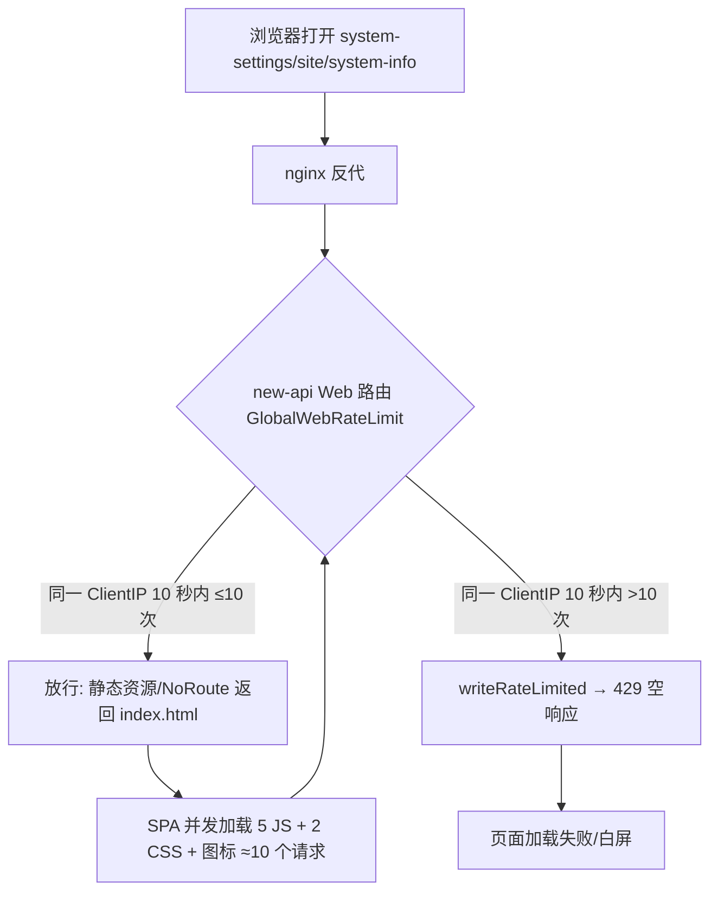
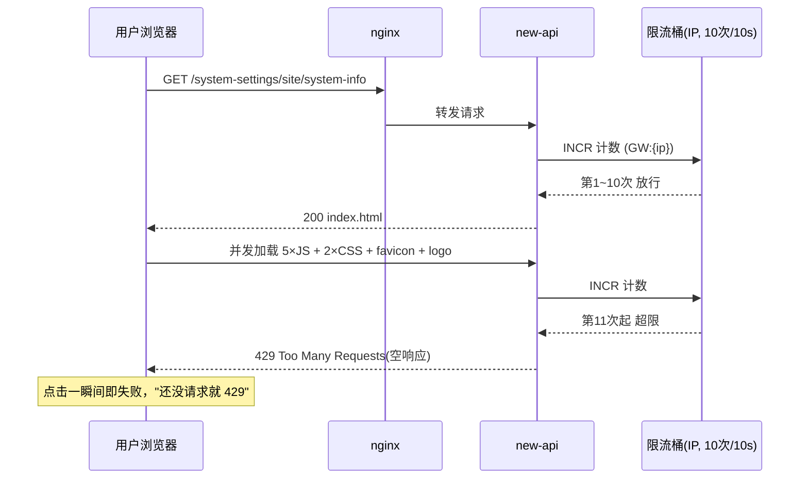

# Bug 主文档：管理面板 SPA 路径瞬间 429 限流误伤

## 一、现象

- 访问 `https://api.luode.vip/system-settings/site/system-info`（管理面板 SPA 路由）时，**点击一瞬间即返回 `429 Too Many Requests`**，页面无法加载。
- 用户感知为"还没有请求就 429"，怀疑存在 Bug 或误开限流。
- 429 响应**无 body、无 Retry-After 头**，仅含 `Server: nginx/1.27.5` 与 `X-Oneapi-Request-Id`。

## 二、影响范围与环境

| 项 | 值 |
|---|---|
| 影响面 | 管理面板 Web 页面（SPA 路由 + 静态资源），波及所有浏览器用户 |
| 域名 | api.luode.vip |
| 入口 | nginx/1.27.5 反向代理 → new-api（docker 容器） |
| 后端 | new-api（本仓库 `F:\new-api`，基于 QuantumNous/new-api） |
| 出现频率 | 每次 SPA 首屏加载/刷新、或其他流量打满配额时 |
| 触发条件 | 10 秒窗口内同一 ClientIP 请求超过 10 次 |

## 三、期望结果 vs 实际结果

- **期望**：打开管理面板页面返回 200，正常渲染。
- **实际**：瞬间返回 429 空响应，页面加载失败。

## 四、复现步骤与证据

1. 连续请求该 URL 16 次（`curl -s -o /dev/null -w "%{http_code}"`）：

```
req1-10: 200 200 200 200 200 200 200 200 200 200
req11-16: 429 429 429 429 429 429
```

2. 429 响应头：

```
HTTP/1.1 429 Too Many Requests
Server: nginx/1.27.5
X-Oneapi-Request-Id: 202608281741276350422828268d9d640TvKV6O
```

3. 对照：`/api/status` 同刻返回 404（JSON，带 `X-Oneapi-Request-Id`，由 new-api 返回）。

**结论：429 由 new-api 的 Web 全局限流中间件返回**（`X-Oneapi-Request-Id` 为 new-api 中间件特征，nginx 仅透传；nginx 自身 limit_req 的 429 不会带该头）。配额精确命中 **10 次 / 10 秒 / ClientIP**。

## 五、根因分析

### 5.1 限流默认开启，且覆盖静态资源

- `common/init.go:125-127`：

```go
GlobalWebRateLimitEnable = GetEnvOrDefaultBool("GLOBAL_WEB_RATE_LIMIT_ENABLE", true)   // 默认开启
GlobalWebRateLimitNum = GetEnvOrDefault("GLOBAL_WEB_RATE_LIMIT", 10)                    // 10 次
GlobalWebRateLimitDuration = int64(GetEnvOrDefault("GLOBAL_WEB_RATE_LIMIT_DURATION", 10)) // 10 秒
```

- `router/web-router.go:22-28`：`GlobalWebRateLimit()` 作为**全局中间件**挂载，位于 `static.Serve`（静态资源）**之前**：

```go
router.Use(gzip.Gzip(gzip.DefaultCompression))
router.Use(middleware.GlobalWebRateLimit())   // ← 所有页面 + 静态资源都计入配额
router.Use(middleware.Cache())
router.Use(static.Serve("/", frontendFS))
```

### 5.2 SPA 首屏并发请求 ≈ 正好 10 次配额

`/system-settings/site/system-info` 是前端 SPA 路由（`web/src/lib/legacy-route.ts` 映射），服务端走 NoRoute 返回 `index.html`。index.html 内联引用：

- 5 个 JS chunk（vendor-ui-primitives / vendor-tanstack / lib-react / 4590 / index）
- 2 个 CSS + favicon + logo.png

浏览器并发加载这些资源，**每个请求都独立计数** → 刷新一次页面即消耗约 10 次配额；叠加任意 API 请求、多标签页、同出口 IP 的其他用户流量，配额瞬间打满 → 后续全部 429。这就是"点击一瞬间、还没看到请求就 429"的真相：请求确实发出去了，只是 10 个并发资源瞬间耗尽配额。

### 5.3 用户"没开限流"的误解

项目未显式配置任何限流环境变量时，**默认值即开启**（`GLOBAL_WEB_RATE_LIMIT_ENABLE=true`），并非用户手动开启。

### 5.4 疑点：Retry-After 缺失 / HEAD 429 后 0.25s GET 200

- `writeRateLimited`（`middleware/rate-limit.go:139`）本应带 `Retry-After`，实测 429 无该头，需进一步确认线上是否 Redis 模式/ttl 取值异常。
- 同窗口内 HEAD 429、紧随 GET 200，疑似**多实例部署 + 内存限流器（桶不共享）** 或出口 IP 变化，待确认部署拓扑。

## 六、修复建议

1. **立即缓解（部署配置）**：`docker-compose` environment 增加：
   - `GLOBAL_WEB_RATE_LIMIT_ENABLE=false`（直接关闭 Web 限流），或
   - `GLOBAL_WEB_RATE_LIMIT=60` / `GLOBAL_WEB_RATE_LIMIT_DURATION=60`（放宽配额）
   - 重启容器生效。`/api` 与 `/v1` 走独立的 `GlobalAPIRateLimit`（默认 360 次/180 秒），不受影响。
2. **治本（代码层，建议提上游 issue）**：静态资源不应计入 Web 限流配额。将 `GlobalWebRateLimit` 移到 `static.Serve` 之后，或对 `/static/`、`/assets/` 等静态前缀放行，仅对页面/API 路由限流。
3. **核对代理链路**：若入口前存在 Cloudflare 或公网 nginx，需配置 `TRUSTED_PROXIES`（`middleware/trusted_proxies.go` 默认仅信任回环/RFC1918/ULA），否则所有用户 ClientIP 收敛为边缘 IP，共享同一限流桶，全站面板随时 429。
4. **核对部署拓扑**：确认是否多实例 + 未启用 Redis（`REDIS_CONN_STRING` 缺失时走内存限流，桶不跨实例共享），补齐 `RedisEnabled` 或接受实例级配额。

## 七、关联代码位置

| 文件 | 位置 | 说明 |
|---|---|---|
| `common/init.go` | 125-127 | Web 限流默认参数（默认开启 10 次/10 秒） |
| `router/web-router.go` | 26 | GlobalWebRateLimit 挂载点（static 之前） |
| `middleware/rate-limit.go` | 160-165、139-145 | 限流中间件与 429 写回 |
| `router/api-router.go` | 19 | /api 独立限流（360 次/180 秒） |
| `middleware/trusted_proxies.go` | 22-50 | 代理信任配置 |

## 八、流程图



## 九、时序图


